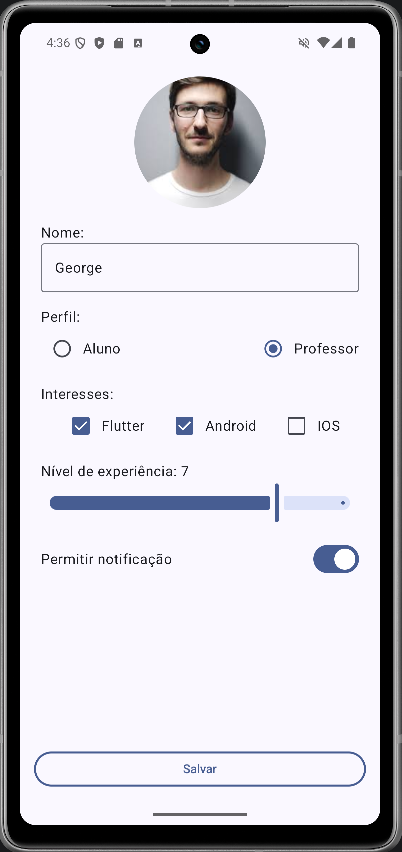
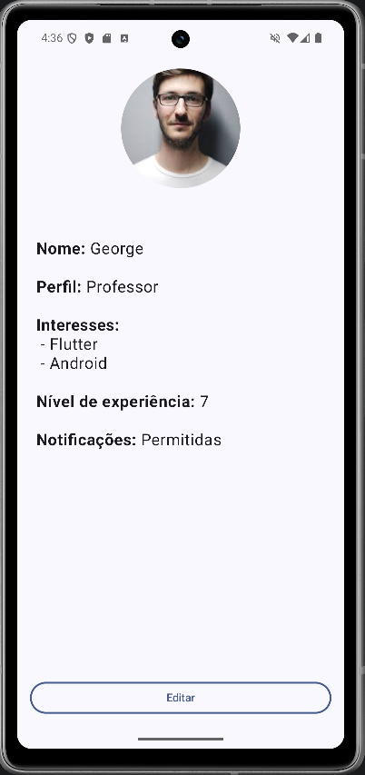

# AKD_PerfilApp

### Descrição
O **PerfilApp** é um aplicativo desenvolvido em Kotlin com Jetpack Compose, como projeto para aprendizado e desenvolvimento de habilidades práticas.  

O foco principal deste projeto foi o **desenvolvimento de formulários interativos** com manipulação e gerenciamento de estados para seus campos, utilizando os mais recentes recursos do **Jetpack Compose**.

Desafio passado durante aula da máteria de Android Kotlin Developer.

---

### 🛠 Stacks Utilizadas:
- **Linguagem**: Kotlin
- **Framework UI**: Jetpack Compose
- **Componentes do Material Design 3**
- **AndroidX Libraries**
    - LifeCycle Runtime
    - Activity Compose
- **Ferramentas de Build**: Gradle

---

### 📚 Aprendizados
Durante o desenvolvimento deste projeto, aprofundei conhecimentos práticos em:
1. **Criação de Formulários Interativos**:
   - Campos de texto com validação: `OutlinedTextField`
   - Botões de seleção: `RadioButton`
   - Caixas de seleção: `Checkbox`
   - Alternadores de estado: `Switch`
   - Barras deslizantes: `Slider`

2. **Manipulação de Estados**:
   - Gerenciamento de estados com `mutableStateOf`
   - Comunicação entre os componentes do formulário através de callbacks altamente reutilizáveis.

---

### 📷 Pré-Visualização

<p align="center">
  
  
</p>

---

### 🚀 Como Executar
1. Clone o repositório:
   ```bash
   git clone https://github.com/Fiszbejn/AKD_PerfilApp.git
   ```
2. Importe o projeto no Android Studio.
3. Compile e execute no emulador ou dispositivo físico.

---

**Autor:** Davi Fiszbejn
